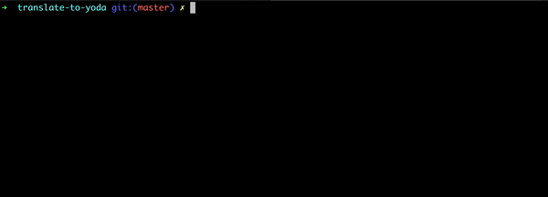

# translate-to-yoda

Translate a sentence to yoda's way of speaking,


## Usage

```javascript
npm run yoda this is the way
```



## Contributing
Pull requests are welcome. For major changes, please open an issue first to discuss what you would like to change.

Please make sure to update tests as appropriate.

## License
[MIT](https://choosealicense.com/licenses/mit/)
